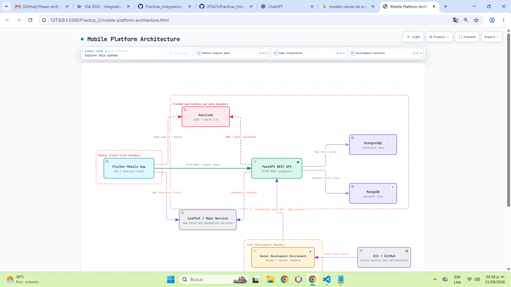
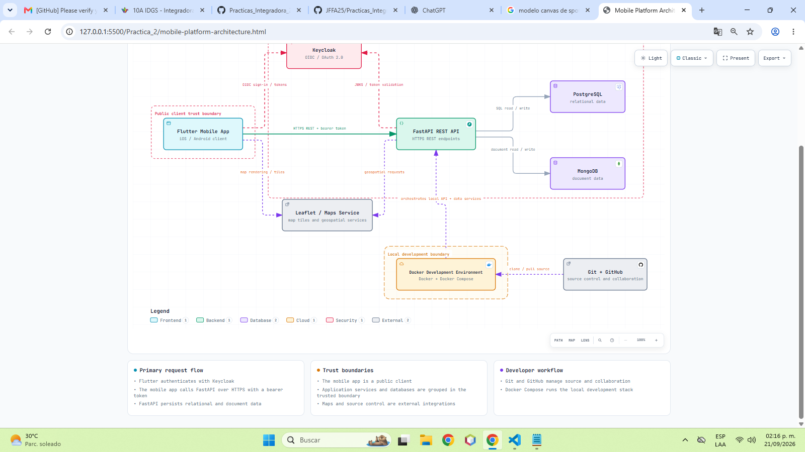

# Práctica 02: Boceto de Arquitectura con Archify

## Descripción

En esta práctica se instaló y utilizó la librería **Archify** para generar un
diagrama de arquitectura de una aplicación móvil mediante un prompt diseñado
para **Codex de ChatGPT**. El objetivo fue transformar los requerimientos
generales de la plataforma en una representación visual, interactiva y
organizada de sus componentes, conexiones, límites de confianza y flujo de
desarrollo.

El resultado es una vista de arquitectura que permite identificar cómo se
comunica la aplicación móvil con los servicios de autenticación, la API, las
bases de datos, los servicios externos y el entorno local de desarrollo.

## Objetivo

Practicar la documentación y visualización de la arquitectura de software con
apoyo de herramientas de inteligencia artificial, describiendo las relaciones
entre los componentes principales de una plataforma móvil antes de su
implementación.

## Arquitectura representada

El diagrama incluye los siguientes elementos:

- **Aplicación móvil Flutter:** cliente para dispositivos iOS y Android.
- **Keycloak:** proveedor de identidad para autenticación mediante OIDC y
	OAuth 2.0.
- **API REST con FastAPI:** servicio backend que recibe las solicitudes HTTPS,
	valida los tokens y coordina el acceso a los datos.
- **PostgreSQL:** base de datos relacional para la información estructurada.
- **MongoDB:** base de datos documental para información flexible o no
	estructurada.
- **Leaflet / servicio de mapas:** integración externa para mostrar mapas,
	consultar ubicaciones y gestionar información geoespacial.
- **Docker y Docker Compose:** entorno local para ejecutar y coordinar la API y
	los servicios de datos.
- **Git y GitHub:** control de versiones, colaboración y administración del
	código fuente.

## Flujo principal

1. La aplicación móvil solicita el inicio de sesión a Keycloak.
2. Keycloak autentica al usuario y entrega los tokens correspondientes.
3. La aplicación utiliza el token bearer para consumir la API REST mediante
	 HTTPS.
4. FastAPI valida el token con la información publicada por Keycloak.
5. La API consulta o actualiza PostgreSQL y MongoDB según el tipo de
	 información requerida.
6. La aplicación y la API pueden comunicarse con el servicio de mapas para
	 representar información geográfica.
7. Git y GitHub administran el código fuente, mientras Docker Compose ejecuta
	 el entorno local de desarrollo.

## Límites de confianza

La arquitectura distingue tres zonas principales:

- **Cliente público:** la aplicación móvil se considera un cliente expuesto y
	no confiable por completo.
- **Aplicación y datos confiables:** Keycloak, FastAPI, PostgreSQL y MongoDB
	forman el límite principal de los servicios internos.
- **Desarrollo local:** Docker representa el entorno utilizado para levantar
	los servicios durante el desarrollo.

## Archivos generados

- [Diagrama de arquitectura interactivo](./mobile-platform-architecture.html)
- [Definición estructurada de la arquitectura](./mobile-platform-architecture.json)
- [Validación visual del diagrama](./mobile-platform-architecture.visual-check.json)
- [Visualizar el diagrama en el navegador](https://htmlpreview.github.io/?https://github.com/Danny88e/Practicas_Integradora_230040/blob/master/Practica_2/mobile-platform-architecture.html)
- [Abrir el archivo HTML del diagrama en GitHub](./mobile-platform-architecture.html)
- [Ver el archivo HTML en GitHub](https://github.com/Danny88e/Practicas_Integradora_230040/blob/master/Practica_2/mobile-platform-architecture.html)

## Evidencia

Las siguientes imágenes muestran la evidencia de la generación y visualización
del diagrama de arquitectura:

## Resultado de la práctica

Se obtuvo un diagrama HTML interactivo con diferentes vistas para explorar el
flujo de solicitudes móviles, la integración con mapas y el flujo de trabajo
de desarrollo. La definición JSON conserva los componentes, conexiones,
fronteras y tarjetas informativas utilizadas para construir el diagrama.

## Autor

**Luis Daniel Suarez Escamilla** / [@Danny88e](https://github.com/Danny88e)
