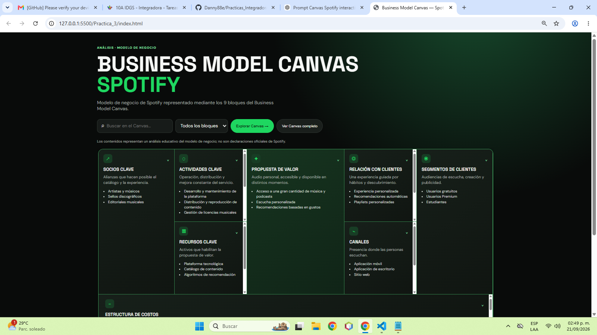
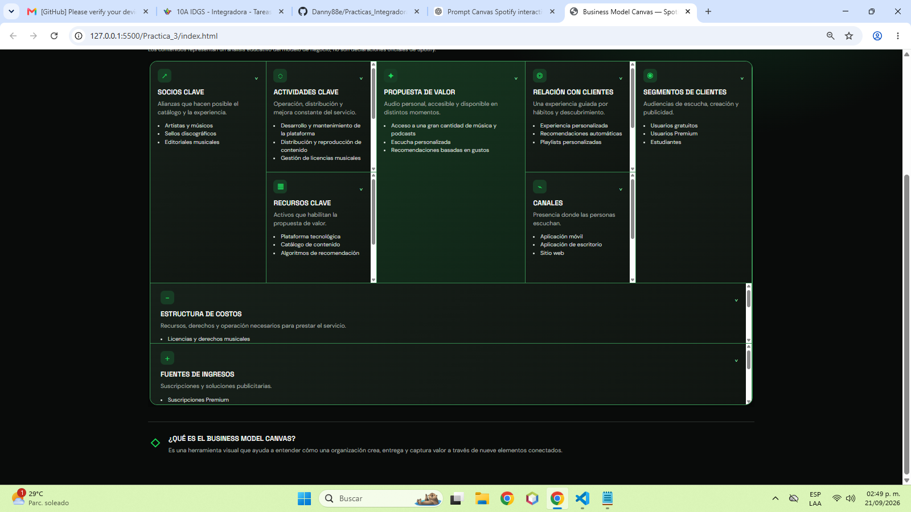

# Práctica 03: Boceto de Modelo Canvas con Archify

## Descripción

En esta práctica se elaboró un **Business Model Canvas** para Spotify, una
herramienta multiplataforma utilizada cotidianamente para escuchar música y
podcasts. Se diseñó un prompt para solicitar a **Archify** la representación
del modelo de negocio y posteriormente se revisó, mejoró y documentó el
resultado.

Además del modelo generado, se implementó una aplicación web interactiva en
español para explorar los nueve bloques del Canvas. La interfaz permite buscar
contenido, filtrar bloques por categoría, expandir tarjetas y recorrer el
modelo mediante un modo guiado.

El contenido se presenta como un análisis educativo y no como información
oficial de Spotify.

## Objetivo

Aplicar buenas prácticas de análisis, diseño de prompts, revisión de resultados
y documentación técnica para representar el modelo de negocio de una
plataforma multiplataforma mediante Archify.

## Actividades realizadas

1. **Elegir la aplicación multiplataforma:** se seleccionó Spotify por su uso
	cotidiano y por integrar aplicaciones móviles, escritorio, web, televisores,
	consolas y automóviles.
2. **Estructurar el prompt:** se definieron el contexto de Spotify, los nueve
	bloques del Business Model Canvas, el formato de salida y el nivel de
	detalle esperado.
3. **Revisar el modelo obtenido:** se verificó que la propuesta incluyera
	socios, actividades, recursos, clientes, canales, costos e ingresos
	relacionados con el servicio.
4. **Editar el prompt:** se ajustaron las instrucciones para mejorar la
	claridad, organización y utilidad visual del modelo generado.
5. **Documentar y agregar al repositorio:** se desarrolló la aplicación web,
	se incorporaron los archivos generados por Archify y se agregaron las
	evidencias de la práctica.

## Bloques del modelo Canvas

El modelo de Spotify contiene los nueve bloques principales:

- **Socios clave:** artistas, sellos discográficos, editoriales, creadores,
  proveedores tecnológicos y fabricantes de dispositivos.
- **Actividades clave:** desarrollo de la plataforma, distribución de contenido,
  gestión de licencias, recomendaciones, marketing y análisis de datos.
- **Recursos clave:** plataforma tecnológica, catálogo, algoritmos, datos,
  marca e infraestructura.
- **Propuesta de valor:** acceso amplio a música y podcasts, personalización,
  recomendaciones y planes gratuitos o Premium.
- **Relación con clientes:** experiencia personalizada, playlists,
  recomendaciones automáticas, soporte y descubrimiento de contenido.
- **Canales:** aplicaciones móvil y de escritorio, sitio web, Smart TVs,
  consolas, automóviles e integraciones con otros dispositivos.
- **Segmentos de clientes:** usuarios gratuitos, Premium, estudiantes,
  familias, anunciantes, artistas y creadores.
- **Estructura de costos:** licencias, infraestructura, desarrollo, marketing,
  personal, operaciones y distribución.
- **Fuentes de ingresos:** suscripciones Premium, publicidad y planes
  individuales, familiares y estudiantiles.

## Archivos de la práctica

- [Aplicación web interactiva](./index.html)
- [Modelo Canvas en HTML generado con Archify](./spotify-canvas-architecture.html)
- [Especificación del modelo Canvas](./spotify-canvas-architecture.json)
- [Código de interacción](./app.js)
- [Datos de los bloques](./data.js)
- [Estilos de la aplicación](./styles.css)
- [Visualizar la aplicación Canvas en GitHub Pages](https://danny88e.github.io/Practicas_Integradora_230040/Practica_3/index.html)
- [Abrir el archivo HTML del modelo Canvas en GitHub](./spotify-canvas-architecture.html)
- [Abrir la aplicación interactiva en GitHub](./index.html)
- [Ver los archivos HTML en GitHub](https://github.com/Danny88e/Practicas_Integradora_230040/tree/master/Practica_3)

## Evidencia

Las siguientes capturas muestran el resultado de la aplicación y del modelo
Canvas generado:

## Resultado de la práctica

Se obtuvo un modelo Canvas documentado para Spotify y una aplicación web
responsive que facilita su consulta. La separación entre datos, lógica,
estructura y estilos permite mantener el proyecto y reutilizarlo para analizar
otras aplicaciones multiplataforma.

## Autor

**Luis Daniel Suarez Escamilla** / [@Danny88e](https://github.com/Danny88e)
