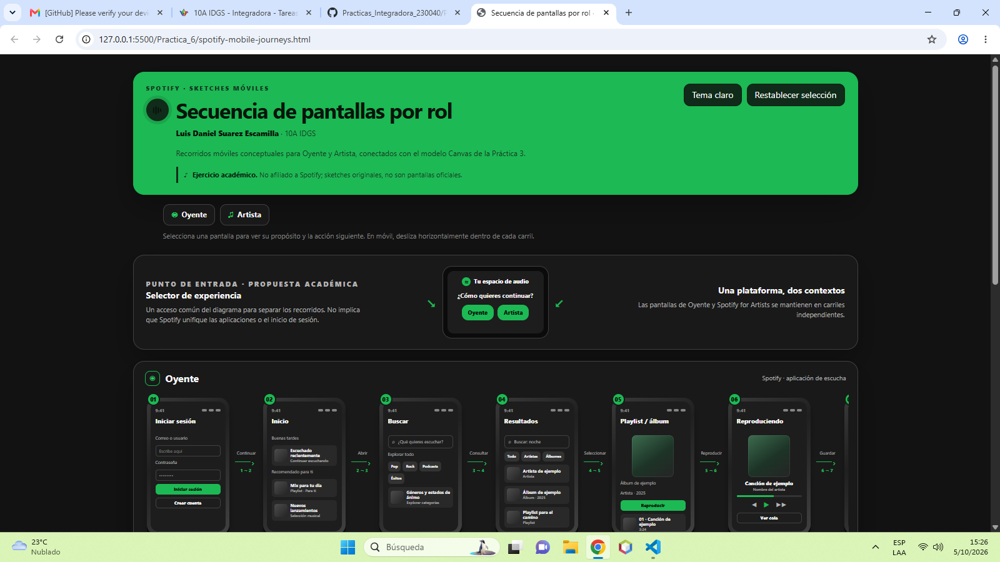
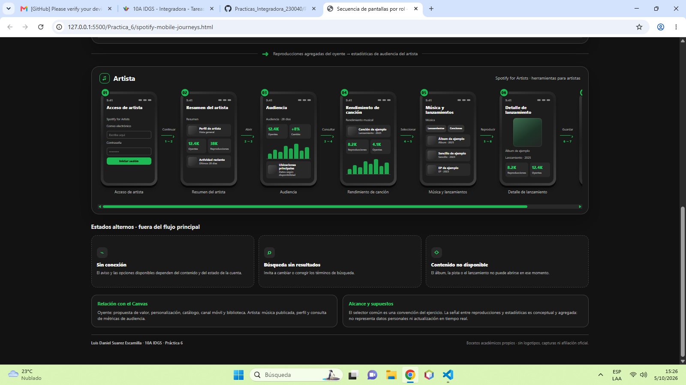
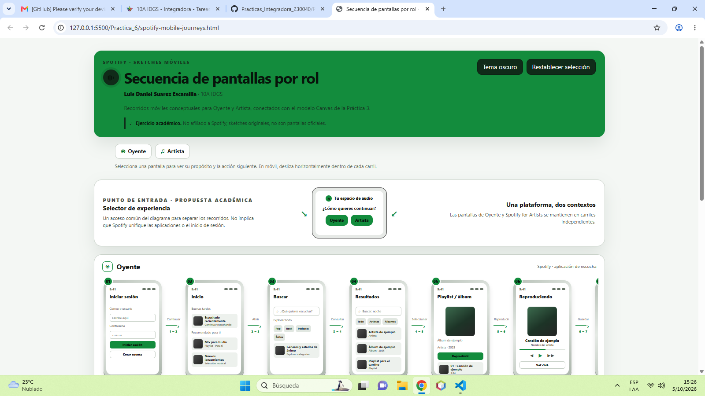
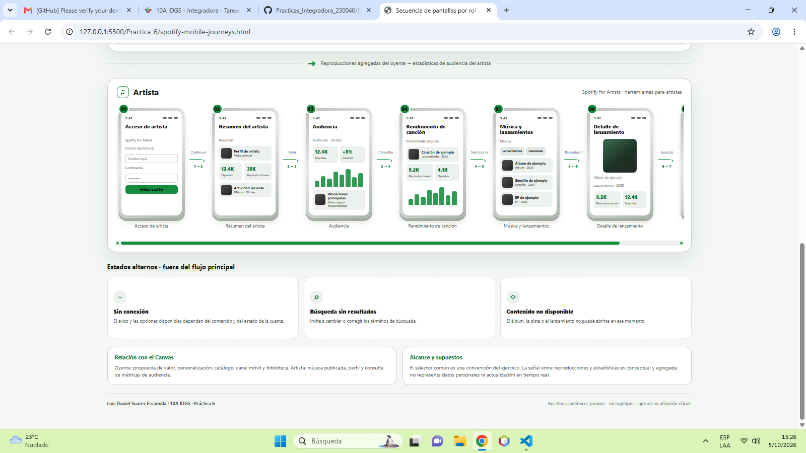

## Práctica 06: Diagrama de Secuencia de Pantallas (Sketches) de Aplicación Móvil con 2 Roles

**Estudiante:** Luis Daniel Suarez Escamilla · 10A IDGS  
**Modalidad:** Individual · **Plataforma:** Spotify  
**Firmas requeridas:** 20 · **Fecha de entrega indicada:** viernes 10 de octubre de 2026

### Entregables

- [Abrir en GitHub Pages](https://danny88e.github.io/Practicas_Integradora_230040/Practica_6/spotify-mobile-journeys.html) ✅💯

### Objetivo de la práctica

Representar la experiencia de una aplicación móvil mediante una secuencia de pantallas para al menos dos roles y un mínimo de quince pantallas compartidas y específicas. El resultado es un diagrama interactivo de baja fidelidad que muestra acciones, transiciones y estados alternos.

### Estructura del diagrama

El artefacto es un solo HTML autocontenido. Presenta dos carriles horizontales, con sketches dentro de marcos de teléfono, numeración y flechas con acciones entre pantallas:

| Carril | Pantallas en orden |
| --- | --- |
| Oyente | Iniciar sesión → Inicio → Buscar → Resultados → Playlist / álbum → Reproduciendo → Tu biblioteca |
| Artista | Acceso de artista → Resumen del artista → Audiencia → Rendimiento de canción → Música y lanzamientos → Detalle de lanzamiento → Perfil del artista |

El selector de experiencia separa ambos recorridos y es una convención académica, no una afirmación de que Spotify y Spotify for Artists compartan un único inicio de sesión. Se incluyen, fuera del flujo principal, los estados **Sin conexión**, **Búsqueda sin resultados** y **Contenido no disponible**. Una relación entre carriles explica de manera conceptual cómo las reproducciones agregadas se vinculan con las estadísticas de audiencia, sin representar seguimiento de datos individuales ni actualización en tiempo real.

### Diseño e interacción

- Paleta oscura de negro carbón y grises con verde **#1DB954** como acento principal.
- Sketches originales y distintos por pantalla; sin capturas, logotipos ni diseños oficiales.
- Selección de rol con navegación al carril correspondiente, realce y foco accesible.
- Detalle de pantalla con propósito, elementos principales y acción siguiente.
- Tema claro/oscuro, controles de teclado, región de anuncios accesibles y respeto de `prefers-reduced-motion`.
- Diseño adaptable: desplazamiento horizontal por carril en pantallas estrechas.

### Evolución de los prompts

1. **Estructura y cobertura:** dos carriles por rol, al menos quince pantallas, sketches móviles, acciones numeradas y estados alternos.
2. **Identidad visual:** fondo oscuro, grises y acento verde Spotify **#1DB954**, con símbolo musical original y aviso académico.
3. **Interacción y accesibilidad:** detalle al seleccionar una pantalla, navegación hacia cada rol, alternancia de tema, foco visible, teclado y movimiento reducido.

### Alcance y atribución

La selección común y los sketches son propuestas para esta actividad, basadas en funciones públicas generales. El diagrama no intenta reproducir exactamente las interfaces de Spotify y no está afiliado con Spotify.

## Evidencia

Las capturas documentan el diagrama en escritorio, ambos recorridos, los estados alternos y el tema claro.

### 1. Recorrido del oyente

### 2. Recorrido del artista y estados alternos

### 3. Tema claro

### 4. Carril del artista en tema claro

## Autor

**Luis Daniel Suarez Escamilla** / [@Danny88e](https://github.com/Danny88e)
